# LYME — Optical Transmission of Composite Video over a Laser Beam

**LYME** is a fully custom, free-space optical (FSO) link that transmits a
**real-time analog video signal** across open air on a modulated laser beam.
Instead of sending digital bits, the laser's brightness is amplitude-modulated to
follow a standard **Composite Video (CVBS)** waveform, proving that basic analog
hardware — a single transistor on the transmit side and one op-amp on the receive
side — can carry the ~5 MHz of bandwidth that live video demands.

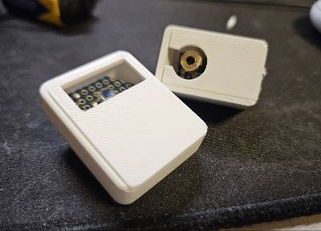

**▶ [Watch the demo](docs/lyme-demo.mp4)** — live video crossing the air on the laser
beam and reconstructed on the monitor.

---

## Contents

- [1. Concept and design rationale](#1-concept-and-design-rationale)
  - [1.1 Goal](#11-goal)
  - [1.2 Why video, and two approaches that failed](#12-why-video-and-two-approaches-that-failed)
  - [1.3 The solution: analog composite video (CVBS)](#13-the-solution-analog-composite-video-cvbs)
  - [1.4 System architecture (the signal pipeline)](#14-system-architecture-the-signal-pipeline)
- [2. The video source](#2-the-video-source)
  - [2.1 The problem](#21-the-problem)
  - [2.2 Proof of concept: ESP32 DAC](#22-proof-of-concept-esp32-dac)
  - [2.3 Raspberry Pi as a hardware DAC](#23-raspberry-pi-as-a-hardware-dac)
  - [2.4 Software configuration](#24-software-configuration)
- [3. Transmitter (TX)](#3-transmitter-tx)
  - [3.1 Why not drive the laser directly?](#31-why-not-drive-the-laser-directly)
  - [3.2 Stage 1 — DC biasing](#32-stage-1--dc-biasing)
  - [3.3 Stage 2 — AC coupling and the "magic node"](#33-stage-2--ac-coupling-and-the-magic-node)
  - [3.4 Stage 3 — the driver (emitter follower)](#34-stage-3--the-driver-emitter-follower)
- [4. Receiver (RX)](#4-receiver-rx)
  - [4.1 Sensor choice: photodiode vs. solar panel](#41-sensor-choice-photodiode-vs-solar-panel)
  - [4.2 Reverse bias for speed](#42-reverse-bias-for-speed)
  - [4.3 Transimpedance amplifier (TIA)](#43-transimpedance-amplifier-tia)
  - [4.4 Stabilization and the feedback loop](#44-stabilization-and-the-feedback-loop)
- [5. Capture: the war with impedance](#5-capture-the-war-with-impedance)
  - [5.1 The EasyCap problem](#51-the-easycap-problem)
  - [5.2 Hardware hack: the 75 Ω series terminator](#52-hardware-hack-the-75-%CF%89-series-terminator)
  - [5.3 Sync slicing and fine calibration](#53-sync-slicing-and-fine-calibration)
- [6. Simulations](#6-simulations)
- [7. Bill of materials](#7-bill-of-materials)
- [8. Repository layout](#8-repository-layout)

---

## 1. Concept and design rationale

### 1.1 Goal

The goal of LYME is to build an entirely custom hardware optical link — through the
air, on a laser beam — capable of carrying a live video signal. It is a study in
**Free Space Optics (FSO)**: a demonstration that plain analog hardware can support
a high enough bandwidth to move real video in real time.

### 1.2 Why video, and two approaches that failed

To make the proof of concept as convincing as possible, I deliberately chose the
hardest payload to transmit. The trivial options were ruled out early:

- **Text (UART over optics):** needs a tiny bandwidth (baud rates of 9600–115200
  bps). Easy to build, but it demonstrates almost nothing about the link's capacity.
- **Audio:** audio occupies a narrow band (20 Hz – 40 kHz). Modulating a laser with
  audio is possible with basic parts, but it never stresses the system.

I settled on video because it pushes the hardware to its absolute limit. Along the
way, two theoretical models were tried and rejected:

**Failed idea 1 — digital baseband transmission.** The obvious first approach is to
send raw bits. The physical layer and the plain arithmetic of digital video kill it:

- An uncompressed 640×480, 8-bit grayscale frame is `640 × 480 × 1 byte = 307,200
  bytes` (≈ 2.45 megabits) — *per frame*.
- If a DIY link (a basic microcontroller and a transistor) reaches a switching rate
  of 1 Mbps — already optimistic without dedicated optical transceivers — it delivers
  **under 0.5 frames per second**.
- To get a smooth 15 FPS, the math forces the resolution down to roughly **32×32
  pixels** — visually meaningless and useless for any practical purpose.

**Failed idea 2 — images via sound.** The next approach converted still images into
audio tones for the laser to transmit.

- *Upside:* very robust against interference, because audio frequencies are easy to
  filter.
- *Downside:* encoding and sending a single still image at acceptable quality takes
  **8–120 seconds**. That latency destroys any notion of "real time".

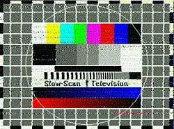

### 1.3 The solution: analog composite video (CVBS)

The way past the bandwidth wall turned out to be a return to analog standards.
**Composite Video (CVBS)** hits the perfect balance of quality, speed and hardware
feasibility:

- A single analog waveform of about **5 MHz** carries everything at once:
  synchronization pulses (H-sync / V-sync), brightness (luma) and color (chroma).
- Instead of switching millions of discrete bits on and off, the laser is
  **amplitude-modulated** — its intensity (brightness) tracks the voltage of the
  analog waveform exactly.
- This sidesteps the digital bandwidth limits and yields smooth **50/60 FPS** while
  keeping high visual resolution.

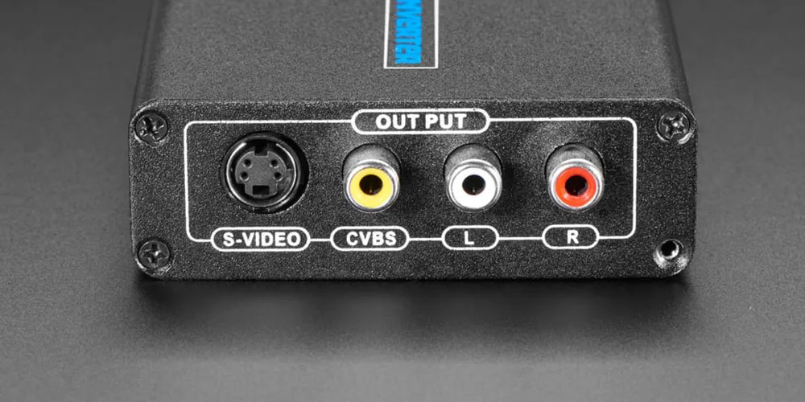

### 1.4 System architecture (the signal pipeline)

The full communication channel is:

1. **Source** — a camera whose digital stream is read by a Raspberry Pi.
2. **DAC conversion** — the Raspberry Pi uses its hardware TV-out to encode the
   signal as analog Composite Video.
3. **Transmitter (TX)** — a circuit that superimposes the AC video signal onto a DC
   bias and drives the laser diode's power.
4. **Medium** — a laser beam through free space.
5. **Sensor** — a BPW34 photodiode operated in reverse bias for maximum speed.
6. **Receiver (RX)** — a transimpedance amplifier (TIA) that converts the tiny
   photocurrent back into video voltage.
7. **Digitizing** — a USB capture card feeds the recovered signal to a display.

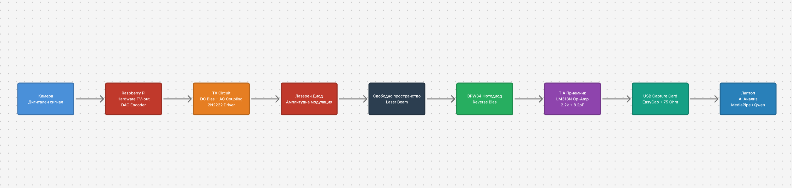

---

## 2. The video source

### 2.1 The problem

The ideal source for testing an analog link is a native analog (CCTV) camera. With
none on hand, I had to generate a valid CVBS signal from the digital gear available.

### 2.2 Proof of concept: ESP32 DAC

Before transmitting live video, I isolated the variables and proved the analog laser
link itself worked, using an **ESP32 microcontroller**.

- **Why the ESP32?** It has hardware 8-bit digital-to-analog converters (DAC).
- Purpose-written code makes the ESP32 generate clean NTSC static **test patterns**,
  putting the analog waveform straight out of **GPIO26**.
- This let me calibrate the transmitter and receiver in a controlled environment
  before introducing the complexity of a live camera and the Raspberry Pi OS.

### 2.3 Raspberry Pi as a hardware DAC

For live, real-time video I used a **Raspberry Pi** connected to a digital camera.
The Pi acts as a bridge and digital-to-analog converter:

1. It reads the digital video stream from the camera.
2. Its built-in hardware video encoder (TV-out) modulates the digital pixels into a
   standard analog PAL/NTSC CVBS signal.
3. It outputs the signal through the analog (yellow) RCA port.

### 2.4 Software configuration

- **OS (Debian Buster):** I used the older Raspberry Pi OS (Buster / Legacy). The
  reason is architectural — newer releases (Bullseye / Bookworm) use a different
  graphics stack (Wayland / Mutter) that frequently conflicts with direct access to
  the hardware composite output. The legacy stack is proven to be more stable for
  generating a clean analog signal.
- **Headless control (SSH):** everything is driven wirelessly over SSH
  (`ssh pi@raspberrypi.local`). This is critical — plugging in an HDMI monitor for
  control automatically disables the analog composite port.
- **Starting the stream:** video is launched with a direct command to the video core:

  ```bash
  sudo ffmpeg -f v4l2 -video_size 640x480 -i /dev/video0 -pix_fmt rgb565le -f fbdev /dev/fb0
  ```

---

## 3. Transmitter (TX)

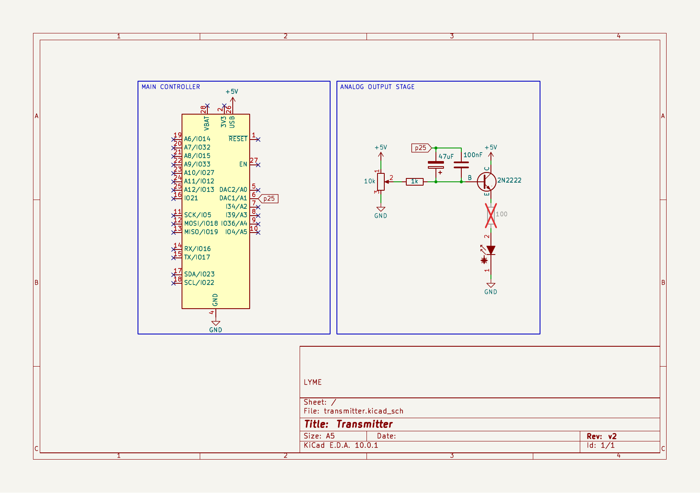

### 3.1 Why not drive the laser directly?

A device's video output is a standardized AC signal of about **1.0 V peak-to-peak**.
A standard red laser diode, on the other hand, needs:

1. **A DC bias** of at least 2.5–3.0 V just to overcome its internal barrier
   (forward voltage, *V<sub>f</sub>*) and begin to emit.
2. **Current** of roughly 20–30 mA for stable operation — well beyond the safe limit
   of a video output.

Connected directly, the laser would never light: 1 V is not enough. An active mixing
and amplifying circuit is required.

### 3.2 Stage 1 — DC biasing

For the laser to convey the light/dark changes of the video, it must first glow at an
average intensity — this is the "carrier" light.

- A **10 kΩ potentiometer** wired between +5 V and GND forms a voltage divider.
- The wiper feeds a steady DC voltage (set by rotation) through a protective
  **1 kΩ resistor** into the transistor's base, holding the laser at its optimal
  operating point (Q-point).

### 3.3 Stage 2 — AC coupling and the "magic node"

The AC video signal must be added on top of the DC supply without the two circuits
shorting each other out.

- The video signal passes through a pair of **parallel capacitors: a 47 µF
  electrolytic and a 100 nF ceramic**.
- **Why two capacitors?** The electrolytic (47 µF) passes low frequencies perfectly
  (such as the 50 Hz V-sync pulses) but has high parasitic inductance (ESL) and
  blocks high frequencies. The ceramic (100 nF) reacts instantly to high frequencies
  (the MHz detail of the picture). Working together, they cover the entire Composite
  Video spectrum.
- The capacitors block DC but pass the AC waveform. Immediately after them, the video
  wave is superimposed on the DC voltage from the potentiometer. This node — the
  **"magic node"** — holds the perfectly mixed signal, ready for amplification.

### 3.4 Stage 3 — the driver (emitter follower)

The weak mixed signal (on the order of microamps) enters the base of a **2N2222 NPN
transistor**.

- The transistor is wired as a **common-collector** stage, also known as an **emitter
  follower**.
- **Why this configuration?** It does not amplify voltage (the emitter voltage simply
  follows the base, minus the ~0.7 V internal drop), but it dramatically amplifies
  **current**. The transistor draws the large current it needs directly from the +5 V
  supply (collector) and delivers it to the laser (emitter), faithfully following the
  shape of the video waveform — all without loading the Raspberry Pi.

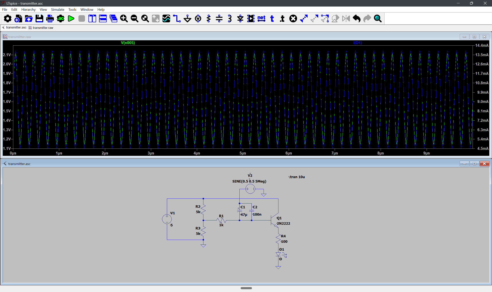

---

## 4. Receiver (RX)

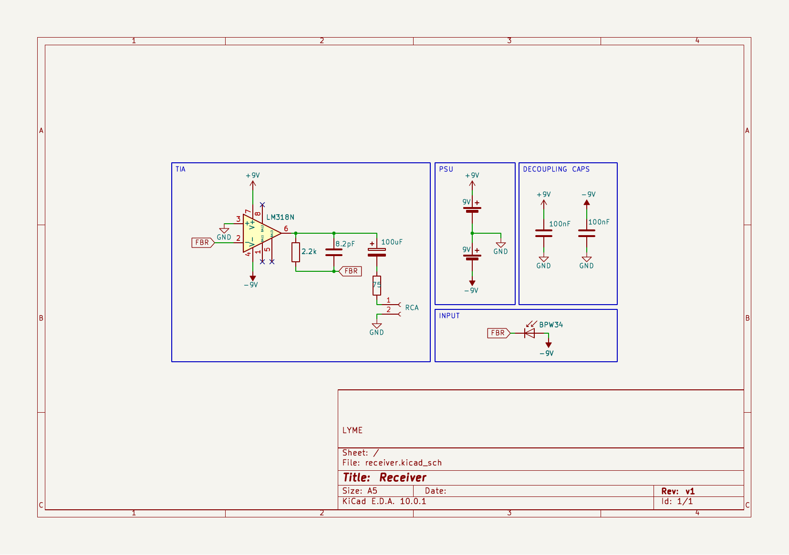

Once the video has crossed free space as modulated light, the receive side must
reverse the process: turn the variations in light intensity back into an electrical
voltage with a bandwidth of ~5 MHz.

### 4.1 Sensor choice: photodiode vs. solar panel

A common mistake in hobby optical links is using a small solar panel as the receiver.
For video, that is physically impossible because of component architecture:

- **Solar panels** are built for energy harvesting. Their huge PN-junction area gives
  an extremely high internal parasitic capacitance (often in the microfarads). That
  capacitance acts as a low-pass filter, limiting the response to tens of hertz.
- The **PIN photodiode (BPW34)** chosen here is designed specifically for high-speed
  data. It has a small capacitance and a very fast rise/fall time.

### 4.2 Reverse bias for speed

Even a fast photodiode like the BPW34 could not handle a 5 MHz video signal if wired
in photovoltaic mode (generating current with no external voltage).

- To reach the needed speed, the BPW34 is wired in **reverse bias**: the anode goes to
  the negative rail (**−9 V**) and the cathode to the amplifier's virtual ground.

### 4.3 Transimpedance amplifier (TIA)

The photodiode produces a current proportional to the incident light (photocurrent),
but that current is tiny (nanoamps to microamps). Standard video inputs expect a
voltage (typically ~1 Vpp). A **transimpedance amplifier (TIA)** performs the
conversion.

- **Op-amp choice:** the high-speed **LM318N** is used. Ordinary audio op-amps (such
  as the LM358 or TL072) are entirely unsuitable — their gain-bandwidth product
  (GBWP) and slew rate are far too low and would "smear" the video. The LM318N offers
  15 MHz of bandwidth, more than enough to preserve the sharp edges of the sync
  pulses.
- **Dual power supply:** the circuit runs from two 9 V batteries forming a true dual
  supply (**+9 V, GND, −9 V**). This is essential so the AC video output can swing
  freely and symmetrically around zero without clipping.

### 4.4 Stabilization and the feedback loop

The TIA's behavior is set by the components in its feedback path (between output
Pin 6 and the inverting input Pin 2):

1. **Gain resistor (R<sub>f</sub> = 2.2 kΩ):** sets the current-to-voltage conversion
   factor (*V<sub>out</sub> = −I<sub>photo</sub> × R<sub>f</sub>*). The 2.2 kΩ value is
   a compromise between a strong enough output signal and keeping the bandwidth high.
2. **Compensation capacitor (C<sub>f</sub> = 8.2 pF):** the most critical passive part
   in the receiver. The op-amp's input capacitance and the photodiode's capacitance
   create a pole in the transfer function that causes instability and high-frequency
   oscillation (ringing). The parallel 8.2 pF capacitor — chosen from the BPW34's
   junction capacitance at −9 V — introduces a zero that compensates the pole. This
   stabilizes the amplifier (phase margin > 45°) and cleans up the video signal.

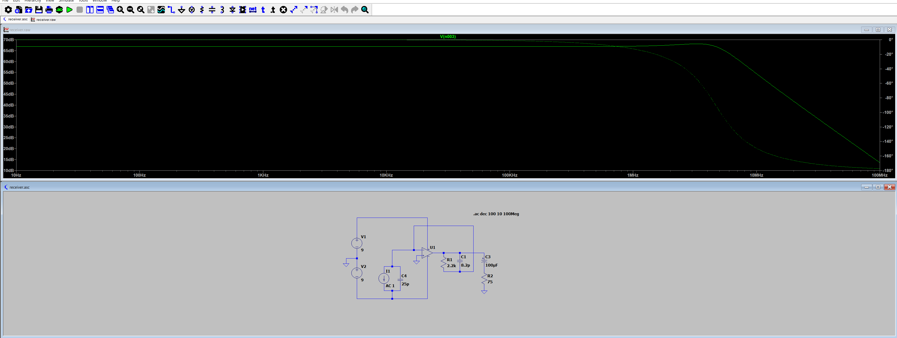

---

## 5. Capture: the war with impedance

After the signal is successfully recovered by the transimpedance amplifier, it has to
be fed to a digitizer. The transition from analog to digital exposed a serious
physical-layer problem during testing.

### 5.1 The EasyCap problem

In the first tests, the receiver output was fed straight to a modern TV with a native
RCA input. The picture was stable and clear. When the same signal was fed to a cheap
USB capture card (EasyCap), the image suffered heavy horizontal smearing/ghosting and
diagonal tearing (horizontal sync loss).

- **The cause:** TVs have high-quality automatic gain control (AGC) and tolerant
  filters. EasyCap devices use basic, extremely strict "sync slicer" ICs. They expect
  a perfectly matched signal with an exact ~1.0 V peak-to-peak amplitude and clean
  black levels for the sync pulses.

### 5.2 Hardware hack: the 75 Ω series terminator

The most critical modification on the receive side was adding a matching resistor.

- **The physics:** the op-amp (LM318N) has a very low output impedance (near 0 Ω) and
  slams the video signal into the RCA cable with high energy. When that signal reaches
  the capture card, part passes through but part is reflected back down the cable
  because of the impedance mismatch. These reflections (an electrical echo) overlay the
  original signal and cause the visible horizontal smearing.
- **The fix:** add a **75 Ω resistor in series** at the output, right after the 100 µF
  AC-coupling capacitor and before the center pin of the RCA jack.
- **The result:** this resistor performs source-impedance matching. It absorbs the
  waves reflected by the capture card, stops the "echo", and restores the sharp
  vertical edges of text and objects in the picture.

### 5.3 Sync slicing and fine calibration

The diagonal tearing was caused by the recovered signal's voltage being too high,
which "blinded" the capture card's sync slicer.

- For the EasyCap to lock the picture, it must recognize the H-sync pulses as the
  lowest voltage level in the whole signal.
- **The calibration procedure:** by microscopically turning the **10 kΩ potentiometer
  on the transmitter (TX)**, I manually lowered the laser's DC bias. This physically
  reduced the overall amplitude of the recovered signal at the receiver until it fell
  inside the EasyCap chip's strict window. At that point the diagonal tearing vanished
  and a stable 50/60 FPS video stream locked in.

---

## 6. Simulations

The transmitter and receiver were validated in **LTspice** before building. The
`.asc` source files and the exported plots live in [`simulations/`](simulations/).

### Transmitter — [`simulations/transmitter.asc`](simulations/transmitter.asc)

A 5 MHz sine (`SINE(0.5 0.5 5Meg)`) models the video signal, mixed onto the DC bias
divider through the 47 µF ∥ 100 nF coupling network and driving the 2N2222 emitter
follower into the laser diode (`.tran 10u`).

| Biased voltage output | Laser drive current |
|---|---|
| 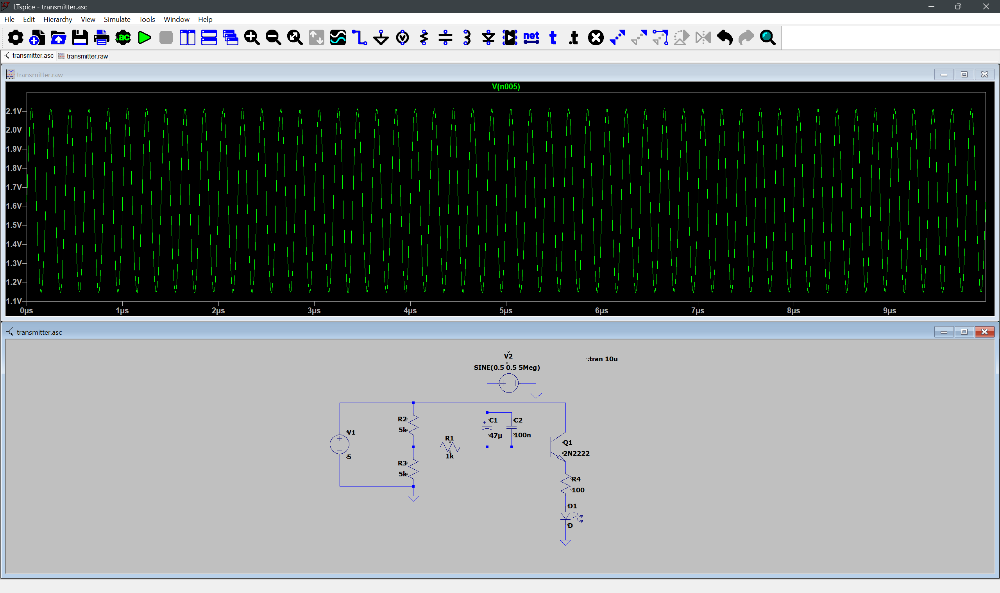 | 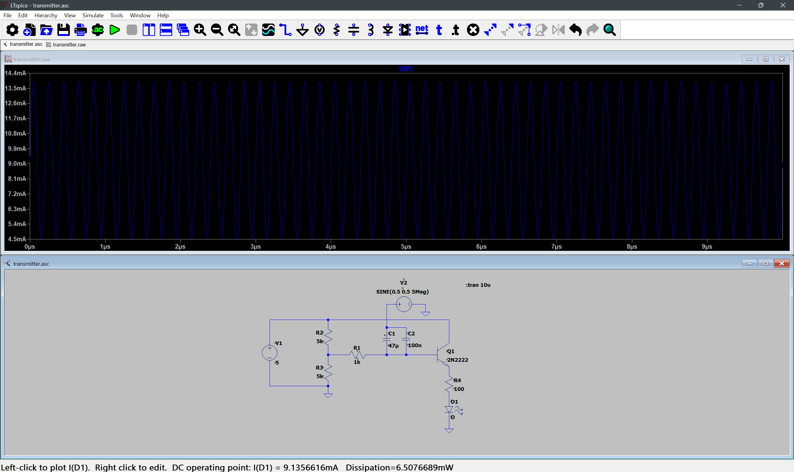 |

### Receiver — [`simulations/receiver.asc`](simulations/receiver.asc)

An AC current source models the photodiode, feeding the LM318N TIA with
R<sub>f</sub> = 2.2 kΩ and C<sub>f</sub> = 8.2 pF, a 25 pF junction-capacitance model,
the 100 µF output coupling and the 75 Ω terminator. An AC sweep
(`.ac dec 100 10 100Meg`) confirms a flat, stable response with the chosen 8.2 pF
compensation.

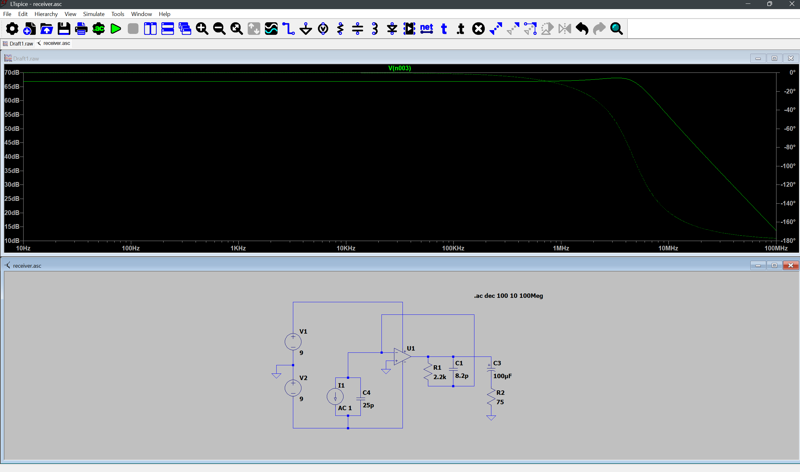

---

## 7. Bill of materials

### Transmitter

| Part | Value / type | Role |
|------|--------------|------|
| Microcontroller / SBC | ESP32 (test patterns) or Raspberry Pi (live video) | CVBS source |
| Laser diode | Red diode module (~650 nm) | Optical emitter |
| Q1 | 2N2222 NPN transistor | Emitter-follower current driver |
| RV1 | 10 kΩ potentiometer | DC bias / brightness set |
| R (base) | 1 kΩ | Base series resistor |
| R (limit) | 100 Ω | Laser current limit |
| C1 | 47 µF electrolytic | AC coupling (low frequencies) |
| C2 | 100 nF ceramic | AC coupling (high frequencies) |
| Supply | +5 V | — |

### Receiver

| Part | Value / type | Role |
|------|--------------|------|
| D1 | BPW34 PIN photodiode | Optical sensor (reverse-biased) |
| U1 | LM318N op-amp | Transimpedance amplifier |
| R<sub>f</sub> | 2.2 kΩ | Transimpedance gain |
| C<sub>f</sub> | 8.2 pF | Feedback compensation |
| C (output) | 100 µF electrolytic | Output AC coupling |
| R (term) | 75 Ω | Series impedance terminator |
| C (decoupling) | 2 × 100 nF | Supply decoupling |
| Supply | 2 × 9 V batteries | True ±9 V dual rail |
| Digitizer | EasyCap USB capture card / RCA display | Recovered-signal readout |

### Enclosure

3D-printed housings for both ends are provided as STL files in
[`enclosure/`](enclosure/): `base`, `boxTX` / `lidTX`, and `boxRX` / `lidRX`.

---

## 8. Repository layout

```
LYME101/
├── README.md
├── LICENSE
├── hardware/
│   ├── transmitter/      KiCad project — transmitter (.kicad_pro/.sch/.pcb)
│   └── receiver/         KiCad project — receiver  (.kicad_pro/.sch/.pcb)
├── simulations/
│   ├── transmitter.asc   LTspice — transmitter driver
│   ├── receiver.asc      LTspice — TIA / receiver
│   └── results/          Exported simulation plots (PNG)
├── enclosure/            3D-printable STL housings (TX + RX)
└── docs/
    └── images/           Schematics, diagrams and photos (+ MANIFEST.md)
```

- **Schematics:** open the `hardware/` projects in [KiCad](https://www.kicad.org/).
- **Simulations:** open the `.asc` files in [LTspice](https://www.analog.com/ltspice).
